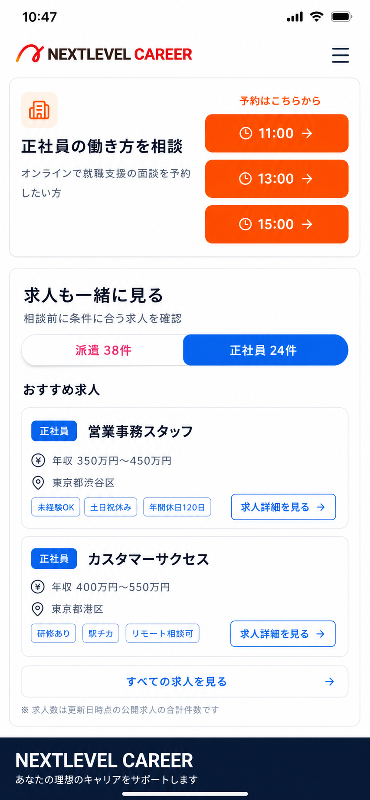

# 相談予約下の雇用形態別求人導線

## 目的

`/consult-jobs` の予約枠カード直下に、雇用形態別の求人導線を追加する。

相談予約だけで終わらせず、ユーザーが相談前に「今ある求人」を確認できるようにする。求人画像は現時点で登録していないため、画像なしのテキストカードで表示する。

## 完成イメージ



## 成功条件

- 予約枠カードの直下に「求人も一緒に見る」セクションが表示される
- 見出し「求人も一緒に見る」の左横にアイコンを置かない
- `派遣 {件数}件` / `正社員 {件数}件` のタブで切り替えられる
- 求人カードは画像なしで、雇用形態バッジ、タイトル、給与、エリア、タグ、詳細ボタンだけで構成する
- `求人詳細を見る` から `/jobs/[id]` に遷移できる
- `すべての求人を見る` から、選択中の雇用形態でフィルタされた求人一覧へ遷移する
  - 正社員: `/jobs?type=正社員`
  - 派遣: `/jobs?type=派遣`
- モバイル幅でテキスト、ボタン、タグが重ならない

## 非目標

- 求人画像やサムネイルを追加しない
- 求人一覧 `/jobs` の検索UIを大きく作り替えない
- DB migration を追加しない
- `consultation_lp_clicks` の `click_type` enum/制約を増やさない
- 予約カード、カレンダー、相談ルートカードの既存挙動を変えない

## UI仕様

配置:

1. 既存ヘッダー
2. 相談ルートカード
3. カレンダー
4. 予約枠カード
5. 新規セクション「求人も一緒に見る」
6. フッター

新規セクション:

- 白背景、薄いボーダー、角丸は既存カードと同程度
- 見出しはテキストのみ
- サブコピー: `相談前に条件に合う求人を確認`
- タブ:
  - `派遣 {dispatch.total}件`
  - `正社員 {fulltime.total}件`
- 初期選択:
  - 選択中ルートが `dispatch` なら派遣
  - 選択中ルートが `fulltime` なら正社員
  - `undecided` なら件数が多い方。迷う場合は派遣
- おすすめ求人は最大2件から3件
- フッターに `すべての求人を見る` の横長ボタン/行を置く

求人カード:

- 画像枠なし
- 左上に雇用形態バッジ
- タイトルは2行まで
- 給与とエリアはアイコン付きで1行表示
- タグは2件から3件まで
- `求人詳細を見る` はカード右下または下部のアウトラインボタン

色:

- 正社員: 既存仕様通り青 (`bg-blue-600`, `text-blue-700`, `border-blue-200`)
- 派遣: 既存仕様通りピンク (`bg-pink-600`, `text-pink-700`, `border-pink-200`)
- CTAの主色は既存オレンジ。ただし求人詳細ボタンは雇用形態色または既存 `primary` のどちらでもよい。モックでは正社員カードを青にしている

## データ設計

既存 `/jobs` はすでに `type` クエリを受けられるため、求人一覧側は原則変更不要。

新規に `/consult-jobs` 用の表示データを作る。

```ts
type ConsultationEmploymentKey = "dispatch" | "fulltime";

type ConsultationEmploymentJobGroup = {
  key: ConsultationEmploymentKey;
  label: "派遣" | "正社員";
  typeQuery: "派遣" | "正社員";
  total: number;
  listUrl: string;
  jobs: ConsultationJobCard[];
};

type ConsultationEmploymentJobSummary = {
  dispatch: ConsultationEmploymentJobGroup;
  fulltime: ConsultationEmploymentJobGroup;
};
```

取得方針:

- `app/jobs/actions.ts` の `getPublicJobsList` を再利用できるなら再利用する
- 直接 Supabase query で取得する場合も、公開求人条件と期限切れ除外は既存一覧と揃える
- 件数は求人一覧の総件数と揃える
- 表示するおすすめ求人は `pageSize: 3` 程度
- ソートは `popular` または `newest`。初期版は `newest` でよい

注意:

- `type=派遣` は既存 `getPublicJobsList` 側で `紹介予定派遣` を含める実装/SQLになっている可能性がある。既存の求人一覧検索と同じ結果になるようにする
- 正社員求人の給与は `fulltime_job_details.annual_salary_min/max` があれば年収表示を優先する
- 派遣求人の給与は `hourly_wage` があれば時給表示を優先する

## 実装候補

触ってよい主なファイル:

- `app/consult-jobs/page.tsx`
- `app/consult-jobs/actions.ts`
- `app/consult-jobs/demoData.ts`
- `components/consult-jobs/ConsultJobsClient.tsx`
- `components/consult-jobs/ConsultationJobList.tsx`
- 必要なら `components/consult-jobs/ConsultationEmploymentJobPreview.tsx` を新規作成

触らないファイル:

- `app/jobs/page.tsx`
- `app/jobs/JobsClient.tsx`
- `components/SearchForm.tsx`
- `supabase/migrations/`
- `.env*`

推奨実装:

1. `app/consult-jobs/actions.ts` に雇用形態別求人サマリー取得関数を追加する
2. `app/consult-jobs/demoData.ts` に demo 用サマリーを追加する
3. `app/consult-jobs/page.tsx` で `routes` と求人サマリーを取得し、`ConsultJobsClient` に渡す
4. `ConsultJobsClient` で選択ルートに応じた初期タブと切替状態を管理する
5. 画像なし表示のため、`ConsultationJobList` を改修するか、新規コンポーネントを追加する
6. `求人詳細を見る` クリック時だけ既存 `recordConsultationLpClick` の `clickType: "job_detail"` を使って記録する
7. `すべての求人を見る` は単純な `Link` で `/jobs?type=...` に遷移する。クリックログ追加はしない

## 検証

最低限:

- `npx tsc --noEmit`
- `/consult-jobs?demo=1` をモバイル幅で確認
- 正社員タブの `すべての求人を見る` が `/jobs?type=正社員` へ向くことを確認
- 派遣タブの `すべての求人を見る` が `/jobs?type=派遣` へ向くことを確認

可能なら:

- `npm run lint`
- `npm run build`
- 実データ `/consult-jobs` で表示確認

## 監督・レビュー方針

実装チャットの戻り報告をこの親チャットでレビューする。

戻り報告では次を必須にする。

- branch/worktree
- base commit
- changed files
- 実装内容
- 検証コマンドと結果
- スクリーンショットまたは表示確認内容
- 未解決リスク
- local main / origin/main / production の反映状態

親チャット側の判定:

- `OK`: 受け入れ条件を満たし、検証も通っている
- `修正依頼`: UI崩れ、型エラー、導線ミス、不要なDB変更、画像枠混入がある
- `保留`: 実データ不足や環境問題で主要確認ができない

## 実装チャット用プロンプト

実装担当には次を渡す。

- `docs/計画/進行中/20260625-consult-jobs-employment-selector-worker-prompt.md`
